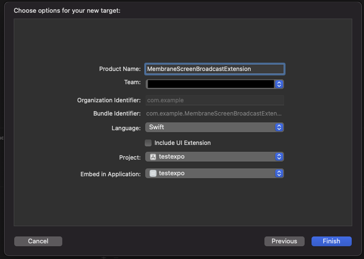
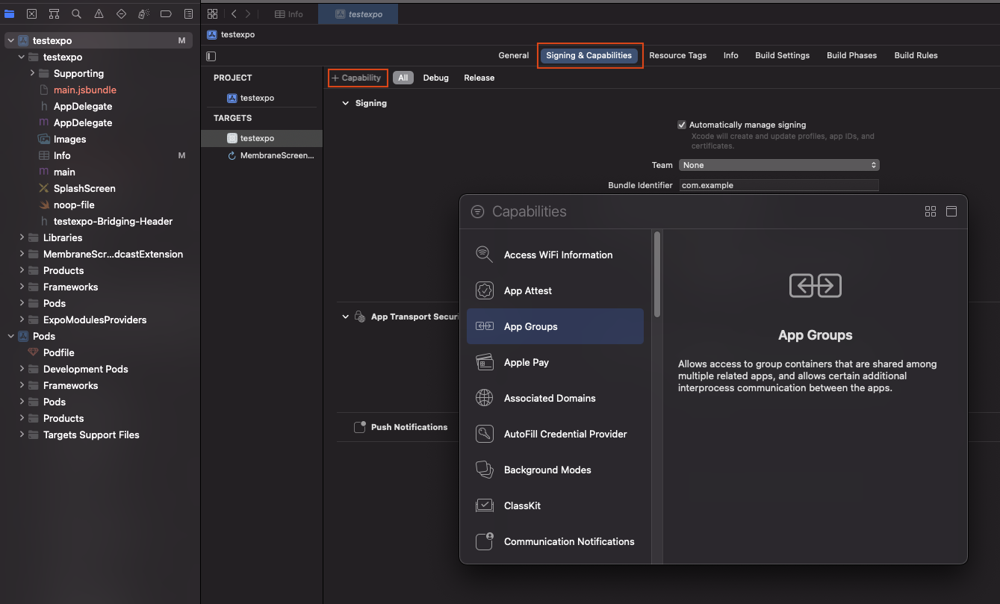
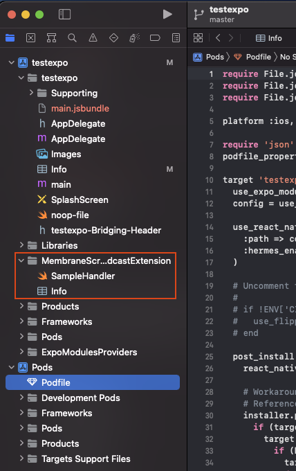

# react-native-membrane-webrtc

react-native-membrane-webrtc is a React Native wrapper for [membrane-webrtc-android](https://github.com/jellyfish-dev/membrane-webrtc-android) and [membrane-webrtc-ios](https://github.com/jellyfish-dev/membrane-webrtc-ios). It allows you to quickly and easily create a mobile client app in React Native for Membrane server.

# Documentation
API documentation is available [here](https://jellyfish-dev.github.io/react-native-membrane-webrtc/)

# Installation

Firstly install react-native-membrane with `yarn` or `npm`

```
yarn add @jellyfish-dev/react-native-membrane-webrtc
```

or

```
npm install --save @jellyfish-dev/react-native-membrane-webrtc
```

### Expo plugin

If you're using development builds with `eas build` or bare workflow you can try using expo plugin to do the configuration below for you.
Simply run:

```
expo install @jellyfish-dev/react-native-membrane-webrtc
```

Add plugin to your `app.json` if it's not already added:

```json
{
  "expo": {
    "name": "example",
    ...
    "plugins": [
      "@jellyfish-dev/react-native-membrane-webrtc"
    ]
  }
}
```

On bare workflow run `expo prebuild` to configure the app, then run `pod install`.
On development build `eas build` should take care of it.

### Android

1. Add camera and microphone permissions to your `AndroidManifest.xml`.
2. Rebuild the app. That's it!

### iOS

On iOS installation is a bit more complicated, because you need to setup a screen broadcast app extension for screensharing.

1. Add camera and microphone permissions to your main `Info.plist`.
   ```xml
   <key>NSCameraUsageDescription</key>
   <string>Allow $(PRODUCT_NAME) to use the camera</string>
   <key>NSMicrophoneUsageDescription</key>
   <string>Allow $(PRODUCT_NAME) to use the microphone</string>
   ```
2. Open your `<your-project>.xcworkspace` in Xcode
3. Create new Broadcast Upload Extension. Select File → New → Target... → Broadcast Upload Extension → Next. Choose the name for the new target, select Swift language and deselect "Include UI Extension".

   

   Press Finish. In the next alert xcode will ask you if you want to activate the new scheme - press Cancel.

4. Configure app group. Go to "Signing & Capabilities" tab, click "+ Capability" button in upper left corner and select "App Groups".

   

   Then in the "App Groups" add a new group or select existing. Usually group name has format `group.<your-bundle-identifier>`. Verify that both app and extension targets have app group and dev team set correctly.

5. A new folder with app extension should appear on the left with contents like this:

   

   Replace `SampleHandler.swift` with `MembraneBroadcastSampleHandler.swift` and this code:

   ```swift
   import Foundation
   import MembraneRTC
   import os.log
   import ReplayKit
   import WebRTC


   /// App Group used by the extension to exchange buffers with the target application
   let appGroup = "{{GROUP_IDENTIFIER}}"

   let logger = OSLog(subsystem: "{{BUNDLE_IDENTIFIER}}.MembraneBroadcastSampleHandler", category: "Broadcaster")

   /// An example `SampleHandler` utilizing `BroadcastSampleSource` from `MembraneRTC` sending broadcast samples and necessary notification enabling device's screencast.
   class MembraneBroadcastSampleHandler: RPBroadcastSampleHandler {
       let broadcastSource = BroadcastSampleSource(appGroup: appGroup)
       var started: Bool = false


       override func broadcastStarted(withSetupInfo _: [String: NSObject]?) {
           started = broadcastSource.connect()

           guard started else {
               os_log("failed to connect with ipc server", log: logger, type: .debug)

               super.finishBroadcastWithError(NSError(domain: "", code: 0, userInfo: nil))

               return
           }

           broadcastSource.started()
       }

       override func broadcastPaused() {
           broadcastSource.paused()
       }

       override func broadcastResumed() {
           broadcastSource.resumed()
       }

       override func broadcastFinished() {
           broadcastSource.finished()
       }

       override func processSampleBuffer(_ sampleBuffer: CMSampleBuffer, with sampleBufferType: RPSampleBufferType) {
           guard started else {
               return
           }

           broadcastSource.processFrame(sampleBuffer: sampleBuffer, ofType: sampleBufferType)
       }
   }
   ```

   Replace `{{GROUP_IDENTIFIER}}` and `{{BUNDLE_IDENTIFIER}}` with your group identifier and bundle identifier respectively.

6. In project's Podfile add the following code:
   ```rb
   target 'MembraneScreenBroadcastExtension' do
     pod 'MembraneRTC/Broadcast'
   end
   ```
   > This new dependency should be added outside of your application target. Example
   >
   > ```rb
   > target 'ReactNativeMembraneExample' do
   >  ...
   > end
   >
   > target 'MembraneScreenBroadcastExtension' do
   >  pod 'MembraneRTC/Broadcast'
   > end
   > ```
7. Run `pod install` in your `ios/` directory
8. Add the following constants in your Info.plist:
   ```xml
   <key>AppGroupName</key>
   <string>{{GROUP_IDENTIFIER}}</string>
   <key>ScreencastExtensionBundleId</key>
   <string>{{BUNDLE_IDENTIFIER}}.MembraneBroadcastSampleHandler</string>
   ```
   Replace `{{GROUP_IDENTIFIER}}` and `{{BUNDLE_IDENTIFIER}}` with your group identifier and bundle identifier respectively.
9. Rebuild the app and enjoy!

# Example

We strongly recommend checking out our example app that implements a basic video room client. To run the app:

1. Go to Membrane's server demo repo: https://github.com/membraneframework/membrane_videoroom. Follow instructions there to setup and run demo server.
2. Clone the repo
3. ```
   $ cd example
   $ yarn
   ```
4. In App.ts replace server url with your server's url.
5. `yarn run android` or `yarn run ios` or run project from Android Studio / Xcode just like every RN project. Note that simulators won't work, you have to test on real device for camera and screensharing to run.

# Usage

Start with connecting to the membrane server. Use `useMembraneServer()` hook to manage connection:

```ts
const { connect, joinRoom, disconnect, error } = useMembraneServer();
```

Connect to the server using the `connect` function and then join the room. Use user metadata to pass things like usernames etc. to the server. After joining the room the user is visible to their peers and vice-versa. You can also pass connection params that will be sent to the socket when establishing the connection tries.

```ts
const startServerConnection = () => {
  try {
    await connect('https://example.com', "Annie's room", {
      userMetadata: {
        displayName: 'Annie',
      },
      connectionParams: {
        token: 'TOKEN',
      },
    });
    await joinRoom();
  } catch (e) {
    console.log('error!');
  }
};
```

Remember to gracefully disconnect from the server using the `disconnect()` function:

```ts
const stopServerConnection = () => {
  await disconnect();
};
```

Also handle errors properly, for example when internet connection fails or server is down:

```ts
useEffect(() => {
  if (error) console.log('error: ', e);
}, [error]);
```

If you have the connection set up, then use `useRoomParticipants()` hook to track the participants. One of the participants will be a local participant (the one who's using the device). When peer joins or leaves the room, the participants will be updated automatically. Simply call the hook like this:

```ts
const participants = useRoomParticipants();
```

When you have the participants all that's left is to render their video tracks. Use `<VideoRendererView />` component like this:

```ts
{
  participant.videoTracks.map((track) => (
    <VideoRendererView trackId={track.id} />
  ));
}
```

You can style the views to lay out them however you'd like, basic animations should work too.

There are also some simple hooks for toggling camera, microphone and screensharing. Use them like this:

```ts
const { isCameraOn, toggleCamera } = useCameraState();
const { isMicrophoneOn, toggleMicrophone } = useMicrophoneState();
```

For screencasting use `useScreencast()` hook. A new participant will be added with type `LocalScreencasting` and you can render it just like any other participant with <VideoRendererView />:

```ts
const { isScreencastOn, toggleScreencast } = useScreencast();
...
toggleScreencast({screencastMetadata: { displayName: "Annie's desktop" }});
```

### Developing
To release a new version of the lib just run `yarn release`, follow the prompts to bump version, make tags, commits and upload to npm
To release a new version of the example app on Android install fastlane, get upload key password and firebase auth json from the devs, update `~/.gradle/gradle.properties` like this:
```
MEMBRANE_UPLOAD_STORE_FILE=my-upload-key.keystore
MEMBRANE_UPLOAD_KEY_ALIAS=my-key-alias
MEMBRANE_UPLOAD_STORE_PASSWORD=********
MEMBRANE_UPLOAD_KEY_PASSWORD=********
```
and run `yarn releaseAppAndroid` from the main directory.

To release a new version of the example app on iOS install fastlane, get added to swmansion app store account and run `yarn releaseAppIos` from the main directory.

Pro tip: when developing set backend url in `.env.development`.

## Credits

This project has been built and is maintained thanks to the support from [dscout](https://dscout.com/) and [Software Mansion](https://swmansion.com).


